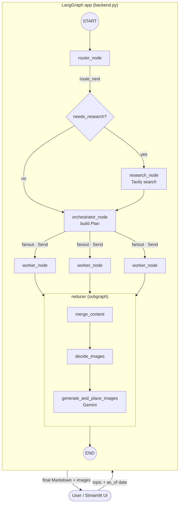
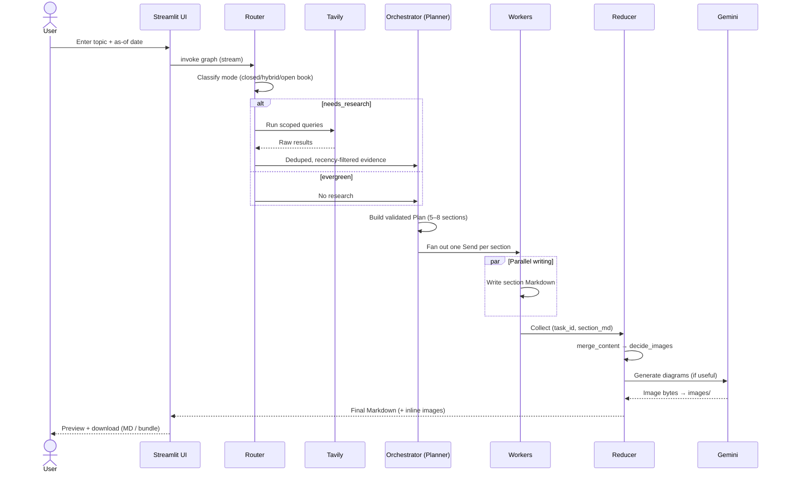

# 📝 Blog Writing Agent

> An agentic, multi-node **LangGraph** pipeline that researches, plans, writes, illustrates, and exports full technical blog posts — driven from a clean **Streamlit** UI.

<p align="center">
  
  
  
  
  
  
  
</p>

---

## 📖 Overview

**Blog Writing Agent** turns a single topic prompt into a complete, well-structured Markdown blog post — optionally grounded in fresh web research and enriched with AI-generated technical diagrams.

It is built around a **LangGraph state machine** that models the editorial process as a graph of specialized nodes: a **Router** decides whether the topic needs web research, a **Research** node pulls evidence from Tavily, an **Orchestrator** drafts a section-by-section outline, parallel **Workers** write each section, and a **Reducer subgraph** merges everything and decides where diagrams add value before generating them with Google Gemini.

The whole workflow is wrapped in a **Streamlit** dashboard that streams live node-by-node progress and lets you inspect the plan, evidence, generated images, and final Markdown — with one-click download of the post or a full bundle (Markdown + images).

---

## ✨ Key Features

- 🧭 **Smart routing** — automatically classifies each topic as `closed_book`, `hybrid`, or `open_book` to decide *if* and *how much* research is required.
- 🔎 **Grounded research** — pulls, dedupes, filters, and recency-scopes evidence via the **Tavily** search API.
- 🗂️ **Structured planning** — generates a validated `Plan` (title, audience, tone, blog kind, 5–8 sections) using **Pydantic** schemas and structured LLM output.
- ⚡ **Parallel section writing** — fans out sections to concurrent worker nodes using LangGraph's `Send` API.
- 🖼️ **Automatic diagrams** — an editor node decides where architecture/flow diagrams help, then generates them with **Gemini 2.5 Flash Image** and places them inline.
- 📡 **Live streaming UI** — Streamlit surfaces node progress, plan, evidence, images, and logs in real time.
- 💾 **Export anywhere** — download the post as Markdown or as a ZIP bundle (Markdown + `images/`).
- 🗃️ **Blog library** — browse and reload previously generated posts from the working directory.
- 🛡️ **Graceful degradation** — missing API keys or failed image generation never crash a run; the pipeline falls back sensibly.
- 📊 **LangSmith tracing** — optional end-to-end observability of every LLM call.

---

## 🧰 Tech Stack

| Layer | Technology |
|-------|-----------|
| **Orchestration** | [LangGraph](https://langchain-ai.github.io/langgraph/) (`StateGraph`, subgraphs, `Send` fan-out) |
| **LLM framework** | LangChain (`langchain-core`, `langchain-community`) |
| **LLM provider** | [Groq](https://groq.com/) — `llama-3.3-70b-versatile`, `qwen/qwen3-32b` |
| **Web research** | [Tavily](https://tavily.com/) via `langchain-tavily` |
| **Image generation** | Google **Gemini** (`gemini-2.5-flash-image`) via `google-genai` |
| **Frontend** | [Streamlit](https://streamlit.io/) |
| **Data & validation** | Pydantic v2, pandas |
| **Config** | python-dotenv, Streamlit secrets |
| **Observability** | LangSmith (optional) |
| **Language** | Python 3.10+ |

---

## 🏗️ Architecture Overview

The application is split into two files:

- **`backend.py`** — defines the Pydantic schemas, the shared LangGraph `State`, all node functions, the reducer subgraph, and compiles the main graph into `app`.
- **`frontend.py`** — a Streamlit app that imports the compiled `app`, streams its execution, and renders the results (plan, evidence, Markdown preview with local images, image gallery, logs).

State flows through the graph as a single typed dictionary (`State`), with each node returning partial updates that LangGraph merges. Section outputs from parallel workers are combined via an `operator.add` reducer on the `sections` field.



### 🔄 Workflow (sequence)



---

## 📂 Folder Structure

```
blog-writing-agent/
├── backend.py           # LangGraph pipeline: schemas, state, nodes, subgraph, compiled app
├── frontend.py          # Streamlit UI: streaming, tabs, rendering, downloads, blog library
├── requirements.txt     # Python dependencies
├── .env.example         # Template for required environment variables
├── .env                 # Your local secrets (gitignored — never commit)
├── .gitignore
├── images/              # Auto-created: AI-generated diagrams for posts
├── *.md                 # Auto-saved generated blog posts (one per run)
└── myenv/               # Local virtual environment (gitignored)
```

> 📌 `images/` and generated `*.md` files are created at runtime — they won't exist on a fresh clone.

---

## 🚀 Installation

### Prerequisites

- **Python 3.10+**
- API keys for **Groq** (required), and optionally **Tavily** (research) and **Google Gemini** (images)

### 1️⃣ Clone the repository

```bash
git clone https://github.com/NishaKushwah2004/blog-writing-agent.git
cd blog-writing-agent
```

### 2️⃣ Create & activate a virtual environment

<details>
<summary><b>🪟 Windows (PowerShell)</b></summary>

```powershell
python -m venv myenv
myenv\Scripts\Activate.ps1
```
</details>

<details>
<summary><b>🍎 macOS / 🐧 Linux (bash/zsh)</b></summary>

```bash
python3 -m venv myenv
source myenv/bin/activate
```
</details>

### 3️⃣ Install dependencies

```bash
pip install -r requirements.txt
```

---

## 🔐 Environment Variables

Copy the template and fill in your own keys:

```bash
cp .env.example .env
```

`.env` (placeholders shown — **never commit real secrets**):

```dotenv
# --- LLM & tools ---
GROQ_API_KEY=YOUR_GROQ_API_KEY            # Required — powers all LLM nodes
TAVILY_API_KEY=YOUR_TAVILY_API_KEY        # Optional — enables web research
GOOGLE_API_KEY=YOUR_GOOGLE_API_KEY        # Optional — enables Gemini image generation

# --- LangSmith tracing (optional) ---
LANGSMITH_API_KEY=YOUR_LANGSMITH_API_KEY
LANGSMITH_TRACING=true
LANGSMITH_PROJECT=Blog-Writing-Agent
LANGSMITH_ENDPOINT=https://api.smith.langchain.com
```

| Variable | Required | Purpose |
|----------|:--------:|---------|
| `GROQ_API_KEY` | ✅ | Router, research, planner, writer, and image-planning LLMs (Groq) |
| `TAVILY_API_KEY` | ⬜ | Web search for `hybrid` / `open_book` topics. Without it, research returns empty and the pipeline stays closed-book |
| `GOOGLE_API_KEY` | ⬜ | Gemini image generation. Without it, image placeholders are replaced by an inline "generation failed" note |
| `LANGSMITH_API_KEY` | ⬜ | Enables LangSmith tracing |
| `LANGSMITH_TRACING` | ⬜ | `true` / `false` toggle for tracing |
| `LANGSMITH_PROJECT` | ⬜ | LangSmith project name |
| `LANGSMITH_ENDPOINT` | ⬜ | LangSmith API endpoint |

> 💡 The app reads secrets via a `get_secret()` helper that prefers **Streamlit secrets** (`st.secrets`) and falls back to environment variables — so it works both locally with `.env` and on Streamlit Cloud with a `secrets.toml`.

---

## ▶️ Running Locally

With your virtual environment active and `.env` configured:

```bash
streamlit run frontend.py
```

Streamlit will open the app in your browser (default: <http://localhost:8501>).

1. Enter a **Topic** in the sidebar (e.g. *"How attention works in transformers"*).
2. Pick an **As-of date** (used for recency filtering in research).
3. Click **🚀 Generate Blog**.
4. Watch live progress, then explore the **Plan**, **Evidence**, **Markdown Preview**, **Images**, and **Logs** tabs.
5. Download the post as Markdown or a full bundle.

---

## ☁️ Deployment

The app is deployment-ready for **Streamlit Community Cloud**:

1. Push the repo to GitHub.
2. Create a new app on [share.streamlit.io](https://share.streamlit.io) pointing at `frontend.py`.
3. Add your keys under **Settings → Secrets** in `secrets.toml` format:

   ```toml
   GROQ_API_KEY = "..."
   TAVILY_API_KEY = "..."
   GOOGLE_API_KEY = "..."
   LANGSMITH_API_KEY = "..."
   LANGSMITH_TRACING = "true"
   LANGSMITH_PROJECT = "Blog-Writing-Agent"
   LANGSMITH_ENDPOINT = "https://api.smith.langchain.com"
   ```

Because secrets are resolved through `get_secret()`, no code changes are needed between local and cloud environments.

> ⚠️ On ephemeral hosts (like Streamlit Cloud) generated `*.md` files and `images/` live only for the session — use the download buttons to persist your work.

---

## ⚙️ How It Works Internally

The pipeline is a LangGraph `StateGraph` compiled into `app`. A single `State` `TypedDict` carries data between nodes; workers append to `sections` via an `operator.add` reducer so parallel writes merge safely.

### Major nodes & functions

| Node / Function | Role |
|-----------------|------|
| `router_node` | Uses `llama-3.3-70b-versatile` with structured output (`RouterDecision`) to decide `needs_research`, the `mode`, scoped `queries`, and a `recency_days` window (7 for open-book, 45 for hybrid, ~10 years for closed-book). |
| `route_next` | Conditional edge → `research` if research is needed, else straight to `orchestrator`. |
| `research_node` | Runs Tavily queries (`_tavily_search`), compresses & dedupes results by URL, extracts an `EvidencePack` via `qwen/qwen3-32b`, and recency-filters evidence for open-book mode. |
| `orchestrator_node` | Produces a validated `Plan` (5–8 `Task`s) with `qwen/qwen3-32b`; forces `blog_kind="news_roundup"` for open-book topics. |
| `fanout` | Emits one `Send("worker", …)` per task (capped at 5 sections), passing task, plan, mode, and trimmed evidence. |
| `worker_node` | Writes exactly one Markdown section (`## Title`) honoring bullets, target words, and citation/code flags; returns `(task_id, section_md)`. |
| `reducer_subgraph` | A nested `StateGraph`: `merge_content` → `decide_images` → `generate_and_place_images`. |
| `merge_content` | Orders sections by task id and assembles the full Markdown body under the blog title. |
| `decide_images` | An editor LLM decides where up to 3 diagrams help, inserting `[[IMAGE_n]]` placeholders and emitting `ImageSpec`s (`GlobalImagePlan`). |
| `generate_and_place_images` | Calls `_gemini_generate_image_bytes` for each spec, saves to `images/`, swaps placeholders for Markdown image tags, and writes the final `*.md` to disk. |

### Pydantic schemas

`Task`, `Plan`, `EvidenceItem`, `RouterDecision`, `EvidencePack`, `ImageSpec`, and `GlobalImagePlan` enforce structured LLM output at every decision point — the LLMs are invoked with `.with_structured_output(...)` so responses are validated automatically.

### Frontend internals (`frontend.py`)

- `try_stream()` — streams graph execution (`updates` → `values` → `invoke` fallback) for live progress.
- `render_markdown_with_local_images()` — a custom Markdown renderer that resolves and displays local `images/` files (and remote URLs) with captions.
- `bundle_zip()` / `images_zip()` — build downloadable ZIPs.
- `list_past_blogs()` — powers the sidebar blog library from `*.md` files in the working directory.

---

## 🔌 API Integrations

| Service | Used for | Model / Endpoint |
|---------|----------|------------------|
| **Groq** | All reasoning/writing LLM calls | `llama-3.3-70b-versatile` (routing), `qwen/qwen3-32b` (research, planning, writing, image planning) |
| **Tavily** | Web search / evidence gathering | `TavilySearch` (via `langchain-tavily`) |
| **Google Gemini** | Diagram/image generation | `gemini-2.5-flash-image` (via `google-genai`) |
| **LangSmith** | Optional tracing/observability | `https://api.smith.langchain.com` |

---

## 💡 Example Usage

**Input topic:**

```
Explain how Retrieval-Augmented Generation (RAG) works, with a system-design diagram.
```

**What happens:**

1. Router → `hybrid` mode, generates a few scoped queries.
2. Tavily returns evidence; the research node dedupes and trims it.
3. Orchestrator plans ~6 sections (What is RAG, Architecture, Retrieval, Generation, Trade-offs, Best practices).
4. Five workers write sections in parallel.
5. `decide_images` inserts an `[[IMAGE_1]]` architecture-diagram placeholder.
6. Gemini generates the diagram into `images/`, and the final post is saved as `explain_how_retrievalaugmented_generation_rag_works.md`.

**Output:** a ready-to-publish Markdown post with an inline system-design diagram, downloadable as a bundle.

---

## 🖼️ Screenshots

> _Replace these placeholders with real screenshots of your running app._

| Generation & Plan | Markdown Preview | Generated Images |
|:--:|:--:|:--:|
|  |  |  |

---

## 🔭 Future Improvements

- [ ] Persistent storage (DB / object store) for generated posts and images.
- [ ] User-selectable models, tone, and length from the UI.
- [ ] Human-in-the-loop editing/approval between planning and writing.
- [ ] Configurable section/image caps (currently fixed at 5 sections / 3 images).
- [ ] Citation footnotes and reference lists rendered from evidence.
- [ ] Pluggable LLM/search/image providers (OpenAI, other engines).
- [ ] Automated tests and CI.
- [ ] Export to HTML / PDF / CMS (WordPress, Ghost, Dev.to) integrations.

---

## 🛠️ Troubleshooting

<details>
<summary><b>❌ <code>GROQ_API_KEY is not set</code> / empty responses</b></summary>

Ensure `.env` exists and contains a valid `GROQ_API_KEY`, or add it to Streamlit secrets. Restart the app after editing `.env`.
</details>

<details>
<summary><b>🔎 Evidence tab is always empty</b></summary>

The topic may be classified as `closed_book`, or `TAVILY_API_KEY` is missing/invalid. Research silently returns `[]` when the key is absent — add a valid Tavily key for grounded posts.
</details>

<details>
<summary><b>🖼️ Images show "[IMAGE GENERATION FAILED]"</b></summary>

Set a valid `GOOGLE_API_KEY` and install `google-genai` (`pip install google-genai`). Failures (quota, safety, SDK changes) are caught and rendered inline so the post stays usable.
</details>

<details>
<summary><b>⚠️ "Image not found" in the preview</b></summary>

The Markdown references an image that isn't in `images/`. Regenerate the post, or download the **bundle** which packages Markdown + images together.
</details>

<details>
<summary><b>🐢 Streamlit auto-reload issues</b></summary>

`watchdog` is included for reliable file watching. If reloads misbehave, restart with `streamlit run frontend.py`.
</details>

---

## 🤝 Contributing

Contributions are welcome!

1. Fork the repository.
2. Create a feature branch: `git checkout -b feature/my-feature`.
3. Commit your changes with clear messages.
4. Push and open a Pull Request describing the change and motivation.

Please keep node functions pure (return partial state updates) and validate any new LLM output with Pydantic schemas to match the existing style.

---

## 📄 License

Released under the **MIT License**. See [`LICENSE`](LICENSE) for details.

---

## 👩‍💻 Author

**Nisha Kushwah**

- GitHub: [@NishaKushwah2004](https://github.com/NishaKushwah2004)
- Project: [blog-writing-agent](https://github.com/NishaKushwah2004/blog-writing-agent)

---

<p align="center"><i>Built with LangGraph 🕸️, Groq ⚡, Tavily 🔎, and Gemini 🖼️.</i></p>
